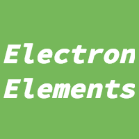

  

# electron-elements

electron-elements is created to have set of custom elements to be used in
an electron app. The main benefits of custom elements inside a electron app
is that they don't need to be polyfilled or need to handle cross browser problems,
thus making creating and maintaing them easier. And with the great collections of 
electron-elements we hope to provide everyone, creating an electron app easier
way to implement some functionality that's customizable and easy to use.

## Do you have a electron element you want to add to this org?

Great we do love to add some great electron-elements to be added!
Follow [this guide](guides/add-an-electron-element-to-org.md) to start the process.

## Code of Conduct

To make electron-elements a positive and welcoming place for everyone,
we put togather a [code of conduct](code_of_conduct.md), which we expect all people to follow
and create a postive, welcoming enviorment for all the people who participte in this org.
